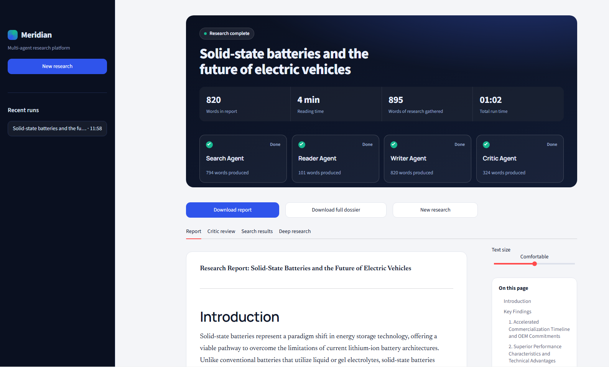
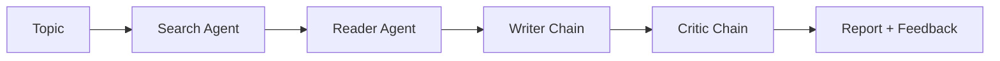

# Multi-Agent Research System

> Type a topic → four AI agents **search, read, write and critique** → you get a researched report.

##  What it does

1. **Search Agent** finds recent and reliable sources on your topic.
2. **Reader Agent** picks the best URL and scrapes it for deeper content.
3. **Writer Chain** turns everything into a structured research report.
4. **Critic Chain** reviews the report and gives feedback.

The Streamlit UI shows live progress for each agent, timing metrics, tabbed results, and a Markdown download.

##  How I built it (my learning path)

I learned this project step by step, from the smallest piece to the full app:

| Step | What I did | File |
|------|-----------|------|
| 1️⃣ | **Created the tools**: functions an agent can call, like web search and page scraping | `tools.py` |
| 2️⃣ | **Created the agents**: gave an LLM those tools and a prompt, plus writer and critic chains | `agents.py` |
| 3️⃣ | **Built the pipeline**: connected everything into a multi-agent system, where each step's output feeds the next | `pipeline.py` |
| 4️⃣ | **Added a UI**: wrapped the pipeline in Streamlit with live progress | `app.py` |
| 5️⃣ | **Deployed it**: Render free tier, plus a wake-up page for cold starts | `index.html` |

**Key takeaways**
- A **tool** is just a function the LLM can decide to call.
- An **agent** = LLM + tools + a loop that decides what to do next.
- A **chain** = a fixed prompt → LLM step, with no tool use.
- A **pipeline** = several agents and chains passing state to each other.

##  Tech stack

Python · Streamlit · LangChain / LangGraph · LLM API · Web search and scraping tools · Render

##  License

MIT. Feel free to learn from it and build on it.